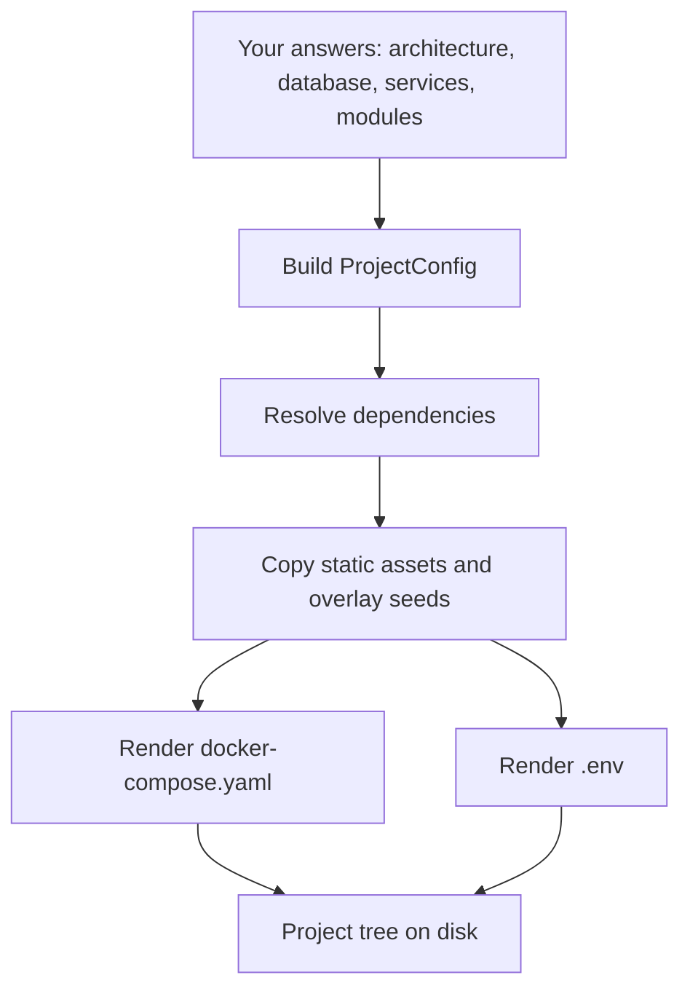
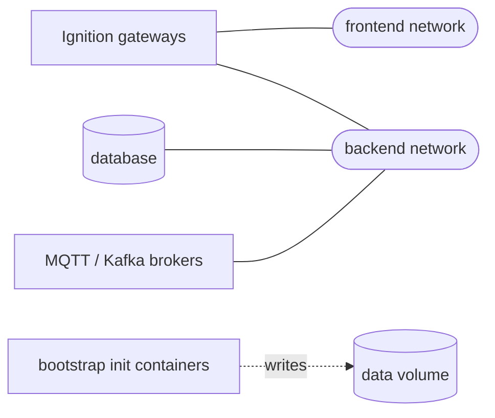

# How generation works

`ignition-stack init` resolves a project configuration into a writable tree on disk. The compose generation engine sits at the heart of that pipeline.

## The pipeline

1. The CLI builds a `ProjectConfig` (name, gateways, database, services, network topology, modules).
2. The dependency resolver expands implicit needs (see below) into a fully-resolved config.
3. The writer copies the static asset tree (`scripts/docker-bootstrap.sh`, per-gateway `services/<name>/` resource directories) and overlays each service's seeds.
4. The compose engine renders `docker-compose.yaml` from a static anchor header, per-service Jinja2 fragments, and a footer that declares volumes (and networks when the split is opted into).
5. The writer renders `.env` from the resolved config, including per-gateway HTTP-port keys for multi-gateway projects and each service's preset credentials.



## The service catalog

Every supported service is a self-contained directory under `templates/services/<name>/`:

- `manifest.yaml` declares the image (and the `.env` key that overrides it), the capabilities the service `provides` and `requires`, its preset `.env` credentials, and which connections it cannot file-seed and defers to `POST-SETUP.md`.
- `compose.yaml.j2` is the service's compose fragment, rendered with a small context (image reference, container name, networks, dependencies).
- `seed/service/` is copied into `services/<name>/` and mounted into the service's own container (a Postgres initdb script, a Keycloak realm export, a broker config).
- `seed/gateway-resources/` is overlaid onto every gateway's `config/resources/` tree, so a service can pre-seed a file-seedable gateway connection. Postgres uses this to ship a working `db-connection` plus the `internal-secret-provider` that holds its password. What is file-seedable on Ignition 8.3 is recorded in the [seeding matrix](../reference/seeding-matrix.md).

Adding a service is a data change: drop a new directory in, and the engine, the `.env` writer, and the seed copier pick it up with no code change.

## The dependency resolver

`services.resolver.resolve()` is a pure transformation run before anything renders. It expands two kinds of rule:

- **Declarative** capability chains from each manifest's `requires`. Keycloak `requires: [sql-database]`, so selecting Keycloak with no database auto-adds Postgres (and a dedicated `keycloak` logical database created on first init).
- **Imperative** couplings: a MySQL database attaches the `mysql-jdbc` driver to every gateway so the connector `.jar` lands in `user-lib/jdbc/`.

The engine renders the resolved config verbatim and never adds or re-resolves services at render time, which keeps the resolution rules testable in isolation.

## Why a hybrid engine

A pure Jinja2 approach makes nested YAML indentation a debugging nightmare. A pure dict-builder loses the hand-written feel maintainers need to read and tweak the generated compose file. The hybrid engine reads a static header that holds the YAML anchors (`x-ignition-common`, `x-ignition-environment`), renders each service as a Jinja2 fragment, concatenates them under `services:`, then round-trips the whole document through ruamel.yaml.

Anchors survive because the entire document is parsed in one context: the alias `*ignition-common` in a gateway fragment resolves to the anchor `&ignition-common` defined earlier in the same string.

## Network topology

By default every service shares the implicit project bridge (no per-service `networks:` block). Opting into `network_split=True` declares two top-level networks - `frontend` and `backend` - and routes services:

- `db` and brokers: `backend` only.
- Ignition gateways: both networks (they need DB reach AND user-facing UI exposure).
- `bootstrap-*` init containers: no network membership; they only write into the data volume.



## Per-gateway env overrides

The `x-ignition-environment` anchor carries the project-wide defaults (`ACCEPT_IGNITION_EULA: "Y"`, `IGNITION_EDITION: standard`, admin credentials, TZ). A gateway that needs a different value (e.g. Edge for a frontend role) inserts an override key after the merge-key reference:

```yaml
environment:
  <<: *ignition-environment
  IGNITION_EDITION: edge
```

Modules attached to a gateway append `ACCEPT_MODULE_LICENSES` and `ACCEPT_MODULE_CERTS` as comma-separated fully-qualified module identifiers. `GATEWAY_MODULES_ENABLED` is a strict whitelist emitted only when a built-in is disabled (see [disable built-in modules](../guides/disable-builtins.md)), so stacks without `disable_builtins` never carry it. The engine looks each module up in `modules.yaml` and rejects unknown slugs at render time.

## Golden tests

Every supported combination has a golden snapshot under `tests/golden/`. Engine changes that affect output text fail the test with a unified diff; an intentional change is committed by re-running the suite with `UPDATE_GOLDENS=1`.

The goldens cover:

- `architectures/<slug>/` - one snapshot per architecture (`basic`, `scale-out`, `hub-and-spoke`, `scale-out-redundant`).
- `services/<name>/` - one minimal snapshot per catalog service (and per database kind).
- `combos/` - key combinations: the smoke stack (Postgres + HiveMQ + OPC-UA-sim) and a network-split stack.

The multi-service `docker compose up` smoke lives behind a `smoke` pytest marker (`pytest -m smoke`); the default run stays fast.
